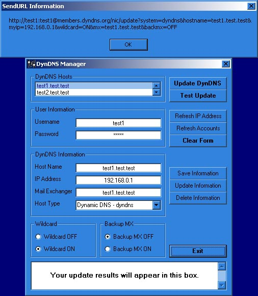



## A DynDNS Manager 2\.7

### Description

NEW VERSION! Added a few more things (HostType information and test-update button), and expanded the database to include Wildcard, BackupMX, and HostType information. No longer has second results window. DynDNS Manager now allows you to store information for multiple DynDNS hosts. It automatically grabs the local IP and any stored settings: username, password, ip, dyndns account name (on local computer) and sends the line to the DynDNS server. It then pops up a results window displaying the result of the update. It is compatible with the new NIC 2.0 guidelines. Any other questions, let me know.

This is by no means finished. I have some error catching to do yet and commenting of the code. Even without the comments, though, it is fairly easy code to understand.

Comments are appreciated, and wanted. Votes not necessary
 
### More Info
 

             |
---                |---
**Submitted On**   |2001-06-18 09:50:56
**By**             |[VBScript](https://github.com/Planet-Source-Code/PSCIndex/blob/master/ByAuthor/vbscript.md)
**Level**          |Intermediate
**User Rating**    |4.4 (35 globes from 8 users)
**Compatibility**  |VB 5\.0, VB 6\.0
**Category**       |[Internet/ HTML](https://github.com/Planet-Source-Code/PSCIndex/blob/master/ByCategory/internet-html__1-34.md)
**World**          |[Visual Basic](https://github.com/Planet-Source-Code/PSCIndex/blob/master/ByWorld/visual-basic.md)
**Archive File**   |[A DynDNS M213146182001\.zip](https://github.com/Planet-Source-Code/vbscript-a-dyndns-manager-2-7__1-12473/archive/master.zip)

